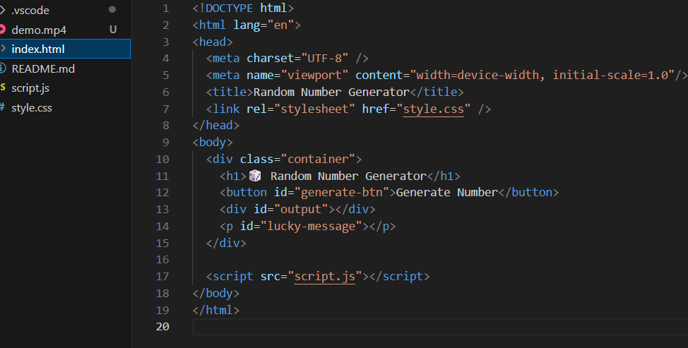

# random

##  What I Learned
- Using `Math.random()` and `Math.floor()` to generate random integers

##  Favorite Feature
The surprise **lucky message** that appears only for high numbers—it feels like winning a mini jackpot!

## Future Improvements
- Allow user to set their own min and max numbers
 [demo](demo.mp4)

---
